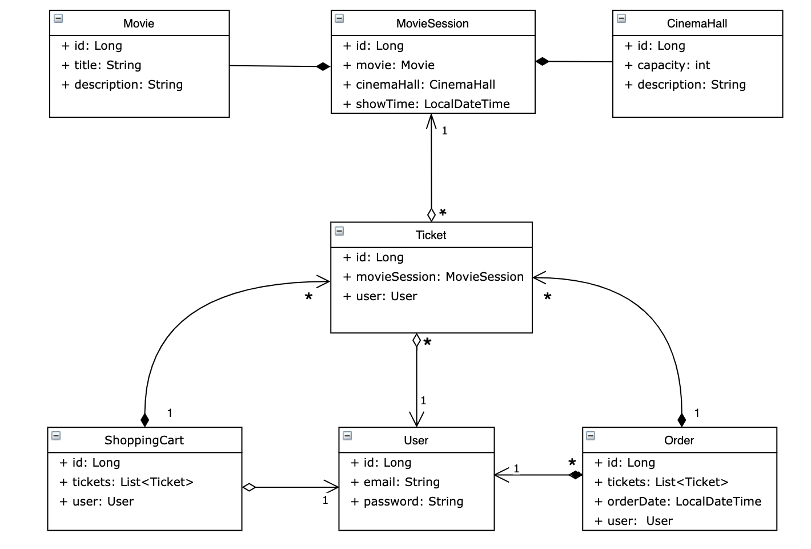

# :movie_camera: Cinema App

---

## :speech_balloon: Project descriptions
`A cinema web-application that supports authentication (that based to roles of users), 
registration, session management and other CRUD operations.`


---

## :clipboard: Futures
+ Users can register as new users to access the application.
+ Users can authenticate themselves to access their accounts.
+ create and find movie
+ create and find available movie session
+ add tickets to shopping cart
+ complete an order
---
## :running: How to launch

1. Clone this project
2. You should prepare Tomcat 9.0.74.
3. In Tomcat Deployment change Application context to "/ "
4. Use file `src/main/resources/db.properties` to make connection with you db.
You should replace `YOUR_DRIVER`, `YOUR_DATA_URL`,
`YOUR_USER`, `YOUR_PASSWORD` with your properties.
5. Build project by using Maven.
6. Use Tomcat to launch application.
7. Use Postman for sending your requests during testing this application
---
## :open_file_folder: Structure
+ Config: configs is respond for all configurations in project
+ In `src/main/java/cinema/config/DataInitializer` you can change
admin email and password for your own.

#### Example:
```java
 public void inject() {
        Role adminRole = new Role();
        adminRole.setRoleName(Role.RoleName.ADMIN);
        roleService.add(adminRole);
        Role userRole = new Role();
        userRole.setRoleName(Role.RoleName.USER);
        roleService.add(userRole);
        User user = new User();
        user.setEmail("admin@i.ua"); // YOUR EMAIL
        user.setPassword("admin123"); // YOUR PASSWORD
        user.setRoles(Set.of(adminRole));
        userService.add(user);
```
**Note:** you can also add more administrators or 
users before launch.

+ Controller: controllers that handle HTTP requests
and response
+ Dao: Data Access Object interfaces and their implementations.
+ Dto: Dto request and response object to receive and provide
information from db.
+ Exception: Custom exception that will be thrown in web application.
+ Lib: Custom annotations that will be used for login validation.
+ Model: Model encompasses objects that serve as the 
foundation for creating tables in the database, ensuring that the 
necessary information is stored correctly.
+ Security: Security is using for authentication based on username.
+ Service: Service contains all business logic.
+ Util: Contains Date pattern.
+ Resources: Contains properties to connect your DB.
---
## :floppy_disk: Database Structure



---
## :key: Used Technologies
+ Tomcat: `v.9.0.74`
+ Java: `v.19.0.1`
+ Maven: `v.3.8.6`
+ Javax: `v.1.3.2`
+ Spring: `v.5.3.20`
+ Spring Security: `v.5.6.10`
+ Hibernate: `v.5.6.14`
+ MySql: `v.8.0.22`
+ Javax Servlet: `v.4.0.1`
+ Jackson Databind: `v.2.14.1`
+ Jackson Datatype jsr310: `v.2.13.0`
